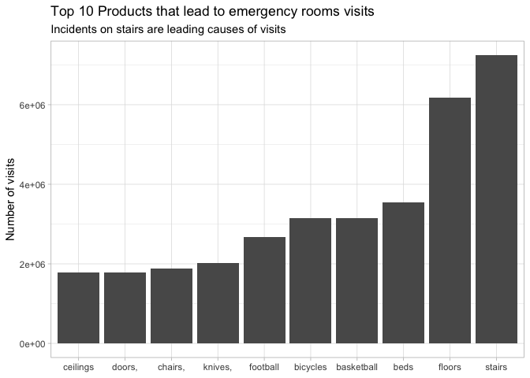
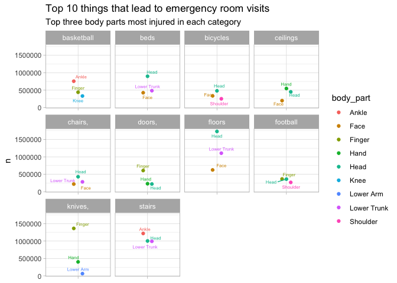
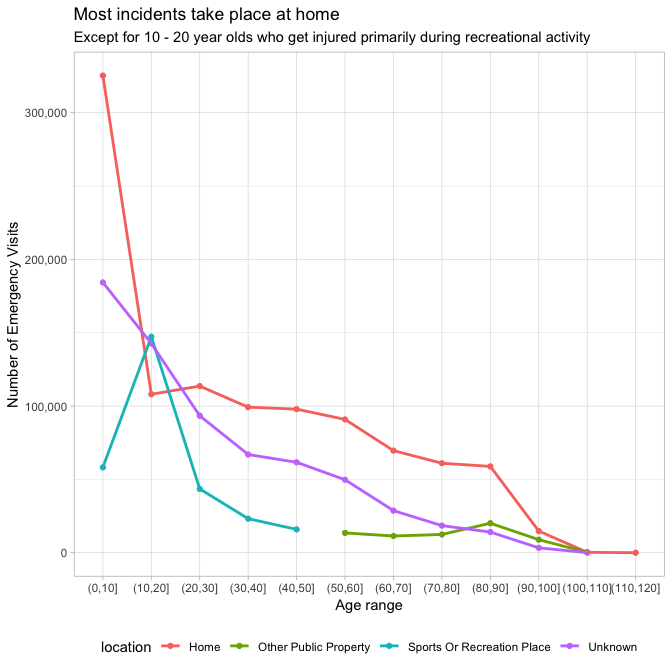
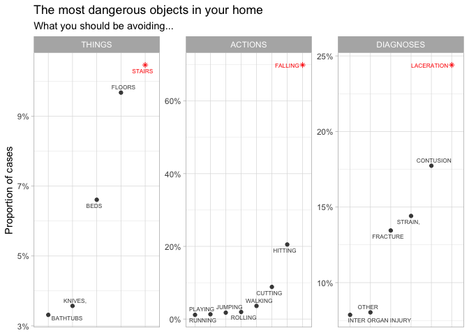

Emergency room visits
================
2018-

``` r
# Libraries
library(tidyverse)
library(ggrepel)
```

``` r
devtools::install_github("hadley/neiss")
```

The data contains three datasets:

-   `injuries`: individual injury results
-   `products`: product code lookup table
-   `population`: population of the US by age, sex, and year

``` r
injuries <- neiss::injuries
products <- neiss::products
population <- neiss::population

df <-
  injuries %>%
  left_join(
    products,
    by = c("prod1" = "code")
  )
```

``` r
top10 <-
  df %>% 
  count(title, body_part, wt = weight) %>% 
  arrange(desc(n)) %>%
  add_count(title, wt = n) %>%
  rename(total_n = nn) %>%
  arrange(desc(total_n)) %>%
  distinct(title, total_n) %>%
  top_n(10, total_n) %>%
  pull(title)

df %>% 
  count(title, body_part, wt = weight) %>% 
  arrange(desc(n)) %>%
  add_count(title, wt = n) %>%
  rename(total_n = nn) %>%
  arrange(desc(total_n)) %>%
  distinct(title, total_n) %>%
  top_n(10, total_n) %>%
  ggplot(mapping = aes(x = fct_reorder(word(title, 1), total_n), y = total_n)) +
  geom_col() +
  labs(
    x = NULL,
    title = "Top 10 Products that lead to emergency rooms visits",
    subtitle = "Incidents on stairs are leading causes of visits",
    y = "Number of visits"
  ) +
  theme_light() 
```



``` r
df %>% 
  count(title, body_part, wt = weight) %>% 
  arrange(desc(n)) %>%
  add_count(title, wt = n) %>%
  rename(total_n = nn) %>%
  arrange(desc(total_n)) %>%
  distinct(title, total_n) %>%
  top_n(10, total_n) %>%
  arrange(desc(total_n)) %>%
  pull(title) ->
  f_labels
```

``` r
df %>% 
  count(title, body_part, wt = weight) %>% 
  arrange(desc(n)) %>%
  filter(title %in% top10) %>%
  group_by(title) %>%
  top_n(3, n) %>%
  ungroup() %>%
  ggplot(mapping = aes(x = word(title, 1), y = n, color = body_part),
         size = 3) +
  geom_point(position = position_dodge(width = 0.2)) +
  labs(
    x = NULL,
    title = "Top 10 things that lead to emergency room visits",
    subtitle = "Top three body parts most injured in each category"
  ) +
  theme_light() +
  facet_wrap(~ word(title, 1), scales = "free_x") +
  geom_text_repel(
    aes(label = body_part), size = 2
  ) +
  theme(
    axis.text.x = element_blank()
  )
```



``` r
df %>%
  filter(age > 0) %>%
  mutate(
    age_bin = cut(age, breaks = seq(0, 120, by = 10))
  ) %>%
  count(age_bin, location) %>% 
  group_by(age_bin) %>%
  top_n(3, n) %>%
  ggplot(mapping = aes(x = age_bin, y = n, color = location)) +
  geom_point() +
  geom_line(aes(group = location, color = factor(location)), size = 1) +
  theme_light() +
  theme(
    legend.position = "bottom"
  ) +
  scale_y_continuous(labels = scales::comma) +
  scale_size_continuous(breaks = seq(0, 300000, by = 50000)) +
  labs(
    x = "Age range",
    y = "Number of Emergency Visits",
    title = "Most incidents take place at home",
    subtitle = "Except for 10 - 20 year olds who get injured primarily during recreational activity"
  ) +
  guides(size = FALSE) 
```



``` r
totalhomemvisits <- 
  df %>%
  filter(
    location == "Home"
  ) %>%
  count(title, wt = weight) %>%
  summarise(total = sum(n)) %>%
  pull()

df %>%
  filter(
    location == "Home"
  ) %>%
  count(title, wt = weight) %>%
  arrange(desc(n)) %>%
  slice(1:5) %>%
  pull(title) ->
  top5prods

narratives <- 
  df %>%
  filter(
    location == "Home", 
    title %in% top5prods
  ) 

test <- data.frame(table(unlist(strsplit(narratives$narrative, " "))))
test <- as_tibble(test)

test %>%
  arrange(desc(Freq)) %>%
  filter(
    !Var1 %in% c("ON", "", " ", "-", "AND", "TO", "A", "AT", "THE", "DX", "OF", 
                 "PT", "IN", "DX:", "YOF", "OUT", "WITH") 
  )
```

    ## # A tibble: 104,383 x 2
    ##    Var1        Freq
    ##    <fct>      <int>
    ##  1 FELL      186186
    ##  2 FLOOR      76647
    ##  3 DOWN       75223
    ##  4 HEAD       70398
    ##  5 BED        58745
    ##  6 HOME       56579
    ##  7 STEPS      37474
    ##  8 HIT        36219
    ##  9 CONTUSION  35240
    ## 10 STAIRS     33965
    ## # ... with 104,373 more rows

``` r
top5verbs <-
  test %>%
  filter(
    Var1 %in% c("FELL", "HIT", "HITTING", "SLIPPED", "CUT", "TRIPPED", "WALKING", 
                "FALLING", "STRUCK", "CUTTING", "ROLLED", "JUMPING", "STRIKING",
                "PLAYING", "RUNNING")
  )

verbs <-
  top5verbs %>%
  mutate(
    verbs = fct_collapse(Var1,
                         FALLING = c("FALLING", "FELL", "SLIPPED", "TRIPPED"),
                         HITTING = c("HIT", "HITTING", "STRUCK", "STRIKING"),
                         CUTTING = c("CUT", "CUTTING"),
                         ROLLING = c("ROLLED")
    )
  ) %>%
  count(verbs, wt = Freq) %>%
  mutate(
    prop = n / nrow(narratives)
  )

df %>%
  filter(
    location == "Home"
  ) %>%
  count(diag, wt = weight) %>%
  arrange(desc(n)) %>%
  slice(1:6)
```

    ## # A tibble: 6 x 2
    ##   diag                         n
    ##   <chr>                    <dbl>
    ## 1 Laceration            9414872.
    ## 2 Contusion Or Abrasion 6843097.
    ## 3 Strain, Sprain        5561523.
    ## 4 Fracture              5190113.
    ## 5 Other Or Not Stated   3100241.
    ## 6 Inter Organ Injury    3036328.

``` r
diagplot <-
  df %>%
  filter(
    location == "Home"
  ) %>%
  count(diag, wt = weight) %>%
  arrange(desc(n)) %>%
  slice(1:6) %>%
  mutate(value = n / totalhomemvisits,
         category = "DIAGNOSES") %>%
  select(
    variable = diag,
    value,
    category
  )

verbsplot <- 
  verbs %>%
  mutate(category = "ACTIONS") %>%
  select(
    variable = verbs,
    value = prop,
    category
  )

prodsplot <-
  df %>%
  filter(
    location == "Home"
  ) %>%
  count(title, wt = weight) %>%
  arrange(desc(n)) %>%
  slice(1:5) %>%
  mutate(
    value = n / totalhomemvisits,
    category = "THINGS"
  ) %>%
  select(
    variable = title,
    value,
    category
  )

plotthis <- rbind(prodsplot, verbsplot, diagplot) %>%
  mutate(
    category = factor(category, levels = c("THINGS", "ACTIONS", "DIAGNOSES")),
    label = word(variable, 1),
    label = if_else(label == "Inter", "Inter Organ Injury", label)
  ) %>%
  mutate(
    label = str_to_upper(label),
    top = if_else(label %in% c("STAIRS", "FALLING", "LACERATION"),
                  "TRUE", "FALSE")
  ) 

plotthis %>%
  ggplot(
    mapping = aes(
      x = fct_reorder(variable, value),
      y = value,
      shape = top,
      color = top
    )
  ) +
  facet_wrap(~ category, scales = "free") +
  theme_light() +
  geom_point() +
  geom_text_repel(aes(label = label), size = 2.2) +
  labs(
    x = NULL,
    y = "Proportion of cases",
    title = "The most dangerous objects in your home",
    subtitle = "What you should be avoiding... "
  ) +
  theme(
    axis.text.x = element_blank(),
    axis.ticks.x = element_blank(),
    legend.position = "empty"
  ) +
  scale_y_continuous(label = scales::percent) +
  scale_shape_manual(values = c("FALSE" = 19, "TRUE" = 8)) +
  scale_color_manual(values = c("FALSE" = "gray28", "TRUE" = "red1"))
```


