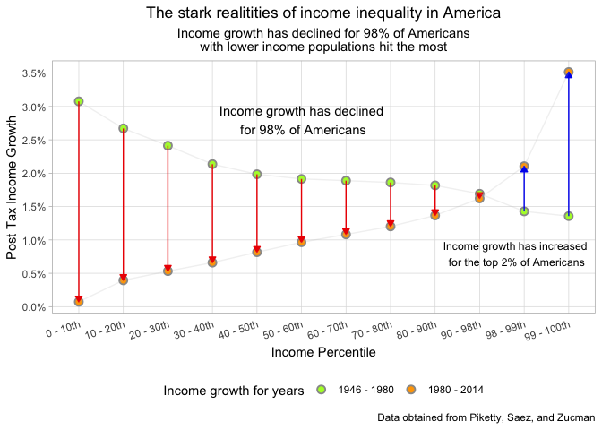

Income Inequality
================
2018-

``` r
# Libraries
library(tidyverse)
library(readxl)

# Parameters
# File with US income growth by percentile
file_income_growth <- "../../data/inequality/data.xlsx"
```

``` r
df <- read_excel(file_income_growth)
glimpse(df)
```

    ## Observations: 134
    ## Variables: 108
    ## $ `Post-tax income`      <dbl> NA, NA, NA, 0, 1, 2, 3, 4, 5, 6, 7, 8, ...
    ## $ X__1                   <dbl> NA, NA, NA, 0, 1, 2, 3, 4, 5, 6, 7, 8, ...
    ## $ X__2                   <dbl> NA, NA, 1946.0000, -420.0302, 688.1345,...
    ## $ X__3                   <dbl> NA, NA, 1947.0000, NA, 703.4124, 1562.1...
    ## $ X__4                   <dbl> NA, NA, 1948.0000, NA, 719.0294, 1596.8...
    ## $ X__5                   <dbl> NA, NA, 1949.0000, NA, 734.9932, 1632.2...
    ## $ X__6                   <dbl> NA, NA, 1950.0000, NA, 751.3114, 1668.4...
    ## $ X__7                   <dbl> NA, NA, 1951.0000, NA, 767.9919, 1705.5...
    ## $ X__8                   <dbl> NA, NA, 1952.0000, NA, 785.0427, 1743.4...
    ## $ X__9                   <dbl> NA, NA, 1953.0000, NA, 802.4721, 1782.1...
    ## $ X__10                  <dbl> NA, NA, 1954.0000, NA, 820.2885, 1821.6...
    ## $ X__11                  <dbl> NA, NA, 1955.0000, NA, 838.5004, 1862.1...
    ## $ X__12                  <dbl> NA, NA, 1956.0000, NA, 857.1167, 1903.4...
    ## $ X__13                  <dbl> NA, NA, 1957.0000, NA, 876.1462, 1945.7...
    ## $ X__14                  <dbl> NA, NA, 1958.0000, NA, 895.5983, 1988.9...
    ## $ X__15                  <dbl> NA, NA, 1959.0000, NA, 915.4822, 2033.0...
    ## $ X__16                  <dbl> NA, NA, 1960.0000, NA, 935.8076, 2078.2...
    ## $ X__17                  <dbl> NA, NA, 1961.0000, NA, 956.5843, 2124.3...
    ## $ X__18                  <dbl> NA, NA, 1962.0000, -596.8525, 977.8222,...
    ## $ X__19                  <dbl> NA, NA, 1963.0000, -681.0745, 1127.6868...
    ## $ X__20                  <dbl> NA, NA, 1964.0000, -765.2965, 1277.5515...
    ## $ X__21                  <dbl> NA, NA, 1965.0000, -400.3045, 1830.5722...
    ## $ X__22                  <dbl> NA, NA, 1966.00000, -35.31249, 2383.592...
    ## $ X__23                  <dbl> NA, NA, 1967.000, 703.130, 3166.943, 49...
    ## $ X__24                  <dbl> NA, NA, 1968.0000, 641.1459, 3293.4077,...
    ## $ X__25                  <dbl> NA, NA, 1969.0000, 678.7772, 3790.7094,...
    ## $ X__26                  <dbl> NA, NA, 1970.0000, 768.4366, 3296.8407,...
    ## $ X__27                  <dbl> NA, NA, 1971.0000, 891.7561, 3123.5054,...
    ## $ X__28                  <dbl> NA, NA, 1972.0000, 705.3153, 3268.8652,...
    ## $ X__29                  <dbl> NA, NA, 1973.0000, 801.6244, 3948.1074,...
    ## $ X__30                  <dbl> NA, NA, 1974.0000, 674.7382, 4636.3593,...
    ## $ X__31                  <dbl> NA, NA, 1975.0000, 796.8605, 4252.3377,...
    ## $ X__32                  <dbl> NA, NA, 1976.0000, 855.2707, 4496.1823,...
    ## $ X__33                  <dbl> NA, NA, 1977.0000, 974.8157, 4657.0928,...
    ## $ X__34                  <dbl> NA, NA, 1978.000, 1535.973, 5204.738, 6...
    ## $ X__35                  <dbl> NA, NA, 1979.000, 1554.196, 5334.673, 6...
    ## $ X__36                  <dbl> NA, NA, 1980.0000, 969.4374, 4970.6169,...
    ## $ X__37                  <dbl> NA, NA, 1981.0000, 496.0988, 4730.5728,...
    ## $ X__38                  <dbl> NA, NA, 1982.0000, -250.3731, 3768.8905...
    ## $ X__39                  <dbl> NA, NA, 1983.000, -1116.173, 3083.269, ...
    ## $ X__40                  <dbl> NA, NA, 1984.000, -902.782, 3572.321, 5...
    ## $ X__41                  <dbl> NA, NA, 1985.0000, -659.1333, 3494.9851...
    ## $ X__42                  <dbl> NA, NA, 1986.000, -1552.847, 3279.737, ...
    ## $ X__43                  <dbl> NA, NA, 1987.000, -1643.469, 3494.256, ...
    ## $ X__44                  <dbl> NA, NA, 1988.000, -1366.251, 3884.082, ...
    ## $ X__45                  <dbl> NA, NA, 1989.000, -2028.416, 3965.981, ...
    ## $ X__46                  <dbl> NA, NA, 1990.000, -5019.522, 3877.195, ...
    ## $ X__47                  <dbl> NA, NA, 1991.000, -3151.284, 3589.187, ...
    ## $ X__48                  <dbl> NA, NA, 1992.000, -2712.397, 3248.237, ...
    ## $ X__49                  <dbl> NA, NA, 1993.000, -2170.648, 3054.015, ...
    ## $ X__50                  <dbl> NA, NA, 1994.000, -1704.673, 3063.886, ...
    ## $ X__51                  <dbl> NA, NA, 1995.000, -1529.767, 3170.387, ...
    ## $ X__52                  <dbl> NA, NA, 1996.000, -1542.133, 3430.341, ...
    ## $ X__53                  <dbl> NA, NA, 1997.000, -2173.185, 3404.657, ...
    ## $ X__54                  <dbl> NA, NA, 1998.000, -3764.825, 3142.262, ...
    ## $ X__55                  <dbl> NA, NA, 1999.000, -5060.348, 2792.440, ...
    ## $ X__56                  <dbl> NA, NA, 2000.000, -8357.050, 2442.249, ...
    ## $ X__57                  <dbl> NA, NA, 2001.000, -8074.641, 2512.637, ...
    ## $ X__58                  <dbl> NA, NA, 2002.000, -4803.115, 1945.287, ...
    ## $ X__59                  <dbl> NA, NA, 2003.000, -4132.895, 1556.791, ...
    ## $ X__60                  <dbl> NA, NA, 2004.000, -3946.606, 1649.750, ...
    ## $ X__61                  <dbl> NA, NA, 2005.000, -4902.995, 2098.725, ...
    ## $ X__62                  <dbl> NA, NA, 2006.000, -5096.824, 1676.526, ...
    ## $ X__63                  <dbl> NA, NA, 2007.000, -5504.620, 3138.243, ...
    ## $ X__64                  <dbl> NA, NA, 2008.000, -6082.491, 1525.324, ...
    ## $ X__65                  <dbl> NA, NA, 2009.0000, -4001.1531, 558.7836...
    ## $ X__66                  <dbl> NA, NA, 2010.0000, -3368.7526, 610.2501...
    ## $ X__67                  <dbl> NA, NA, 2011.0000, -3725.1694, 569.9425...
    ## $ X__68                  <dbl> NA, NA, 2012.0000, -3406.4283, 525.1792...
    ## $ X__69                  <dbl> NA, NA, 2013.0000, -4860.4966, 651.0502...
    ## $ X__70                  <dbl> NA, NA, 2014, -3884, 558, 3645, 6118, 8...
    ## $ X__71                  <lgl> NA, NA, NA, NA, NA, NA, NA, NA, NA, NA,...
    ## $ `Post tax growth from` <chr> "to", NA, NA, NA, NA, NA, NA, NA, NA, N...
    ## $ `1946`                 <dbl> 1.980000e+03, NA, NA, NA, NA, NA, NA, N...
    ## $ `1947`                 <dbl> 1.981000e+03, NA, NA, NA, NA, NA, NA, N...
    ## $ `1948`                 <dbl> 1.982000e+03, NA, NA, NA, NA, NA, NA, N...
    ## $ `1949`                 <dbl> 1.983000e+03, NA, NA, NA, NA, NA, NA, N...
    ## $ `1950`                 <dbl> 1.984000e+03, NA, NA, NA, NA, NA, NA, N...
    ## $ `1951`                 <dbl> 1.985000e+03, NA, NA, NA, NA, NA, NA, N...
    ## $ `1952`                 <dbl> 1.986000e+03, NA, NA, NA, NA, NA, NA, N...
    ## $ `1953`                 <dbl> 1.987000e+03, NA, NA, NA, NA, NA, NA, N...
    ## $ `1954`                 <dbl> 1.988000e+03, NA, NA, NA, NA, NA, NA, N...
    ## $ `1955`                 <dbl> 1.989000e+03, NA, NA, NA, NA, NA, NA, N...
    ## $ `1956`                 <dbl> 1.990000e+03, NA, NA, NA, NA, NA, NA, N...
    ## $ `1957`                 <dbl> 1.991000e+03, NA, NA, NA, NA, NA, NA, N...
    ## $ `1958`                 <dbl> 1.992000e+03, NA, NA, NA, NA, NA, NA, N...
    ## $ `1959`                 <dbl> 1.993000e+03, NA, NA, NA, NA, NA, NA, N...
    ## $ `1960`                 <dbl> 1.994000e+03, NA, NA, NA, NA, NA, NA, N...
    ## $ `1961`                 <dbl> 1.995000e+03, NA, NA, NA, NA, NA, NA, N...
    ## $ `1962`                 <dbl> 1.996000e+03, NA, NA, NA, NA, NA, NA, N...
    ## $ `1963`                 <dbl> 1.997000e+03, NA, NA, NA, NA, NA, NA, N...
    ## $ `1964`                 <dbl> 1.998000e+03, NA, NA, NA, NA, NA, NA, N...
    ## $ `1965`                 <dbl> 1.999000e+03, NA, NA, NA, NA, NA, NA, N...
    ## $ `1966`                 <dbl> 2.000000e+03, NA, NA, NA, NA, NA, NA, N...
    ## $ `1967`                 <dbl> 2.001000e+03, NA, NA, NA, NA, NA, NA, N...
    ## $ `1968`                 <dbl> 2.002000e+03, NA, NA, NA, NA, NA, NA, N...
    ## $ `1969`                 <dbl> 2.003000e+03, NA, NA, NA, NA, NA, NA, N...
    ## $ `1970`                 <dbl> 2.004000e+03, NA, NA, NA, NA, NA, NA, N...
    ## $ `1971`                 <dbl> 2.005000e+03, NA, NA, NA, NA, NA, NA, N...
    ## $ `1972`                 <dbl> 2.006000e+03, NA, NA, NA, NA, NA, NA, N...
    ## $ `1973`                 <dbl> 2.007000e+03, NA, NA, NA, NA, NA, NA, N...
    ## $ `1974`                 <dbl> 2.008000e+03, NA, NA, NA, NA, NA, NA, N...
    ## $ `1975`                 <dbl> 2.009000e+03, NA, NA, NA, NA, NA, NA, N...
    ## $ `1976`                 <dbl> 2.010000e+03, NA, NA, NA, NA, NA, NA, N...
    ## $ `1977`                 <dbl> 2.011000e+03, NA, NA, NA, NA, NA, NA, N...
    ## $ `1978`                 <dbl> 2.012000e+03, NA, NA, NA, NA, NA, NA, N...
    ## $ `1979`                 <dbl> 2.013000e+03, NA, NA, NA, NA, NA, NA, N...
    ## $ `1980`                 <dbl> 2.014000e+03, NA, NA, NA, NA, NA, NA, N...

``` r
income <-
  df %>%
  rename(
    growth_1946 = `1946`, 
    growth_1980 = `1980`,
    income_bracket = `Post-tax income`) %>%
  select(income_bracket, growth_1946, growth_1980) %>%
  slice(-c(1:3))

income <-
  income %>%
  mutate(
    percentile = case_when(
      income_bracket < 10 & income_bracket >= 0 ~ "0 - 10th",
      income_bracket < 20 & income_bracket >= 10 ~ "10 - 20th",
      income_bracket < 30 & income_bracket >= 20 ~ "20 - 30th",
      income_bracket < 40 & income_bracket >= 30 ~ "30 - 40th",
      income_bracket < 50 & income_bracket >= 40 ~ "40 - 50th",
      income_bracket < 60 & income_bracket >= 50 ~ "50 - 60th",
      income_bracket < 70 & income_bracket >= 60 ~ "60 - 70th",
      income_bracket < 80 & income_bracket >= 70 ~ "70 - 80th",
      income_bracket < 90 & income_bracket >= 80 ~ "80 - 90th",
      income_bracket < 98 & income_bracket >= 90 ~ "90 - 98th",
      income_bracket < 99 & income_bracket >= 98 ~ "98 - 99th",
      income_bracket <= 100 & income_bracket >= 99 ~ "99 - 100th",
      TRUE ~ "Unkwown"
    )
  )

dplot <-
  income %>%
  group_by(percentile) %>%
  summarise_at(
    vars(growth_1946, growth_1980),
    mean,
    na.rm = TRUE
  ) %>%
  gather(variable, value, -percentile) %>%
  mutate(
    variable = factor(variable, levels = c("growth_1946", "growth_1980"),
                      labels = c("1946 - 1980", "1980 - 2014")),
    last_percentile = as.integer(parse_number(word(percentile, 2, sep = " - "))),
    below_98 = last_percentile <= 98
  ) 

dplot %>%
  ggplot(mapping = aes(x = percentile, y = value, color = variable)) + 
  geom_point(aes(fill = variable), color = "gray60", size = 2.5, pch = 21,
             stroke = 1) +
  geom_line(
    aes(group = percentile, color = below_98), 
    arrow = arrow(type = "closed", length = unit(0.075, "inches")),
    show.legend = FALSE, size = 0.5) + 
  geom_line(aes(group = variable), color = "gray", alpha = 0.2,
            show.legend = FALSE) + 
  theme_light() +
  theme(
    axis.ticks.x = element_blank(),
    axis.text.x = element_text(angle = 18, vjust = .99, hjust = 1),
    panel.grid.minor.y = element_blank(),
    legend.position = "bottom",
    plot.title = element_text(hjust = 0.5),
    plot.subtitle = element_text(hjust = 0.5)
  ) +
  labs(
    x = "Income Percentile",
    y = "Post Tax Income Growth",
    caption = "Data obtained from Piketty, Saez, and Zucman",
    title = "The stark realitities of income inequality in America",
    subtitle = "Income growth has declined for 98% of Americans\nwith lower income populations hit the most",
    fill = "Income growth for years"
  ) +
  scale_y_continuous(labels = scales::percent, breaks = seq(0, .04, 0.005)) +
  scale_color_manual(
    values = c(
      "FALSE" = "blue2",
      "TRUE" = "red2",
      `1946 - 1980` = "greenyellow",
      `1980 - 2014` = "orange"
    )
  ) +
  scale_fill_manual(
    values = c(
      `1946 - 1980` = "greenyellow",
      `1980 - 2014` = "orange"
    )
  ) +
  annotate(
    "text",
    x = 6,
    y = .028,
    label = "Income growth has declined\n for 98% of Americans"
  ) +
  annotate(
    "text",
    x = 10.8 ,
    y = .008,
    label = "Income growth has increased\n for the top 2% of Americans",
    size = 3.25
  )
```



I find that the income growth has declined for the bottom 98% of Americans when compared to the period from 1946 - 1980. This is drastic and goes to show the growing income inequalities in America. Also it is interesting that the poorer one is the more stagnant one's income and the greater the delcine. As you can see the red arrows are longer for the lowest income percentiles. The opposite was seen for the years 1980 - 2014, with the lower income percentiles representing the greater shares of income growth. Also, 50% of Americans are experiencing less than 1% of income growth! That is insane. While the top 2% of Americans are experiencing greater than 2% income growth and the top 1% experiencing 3.5% increase.
