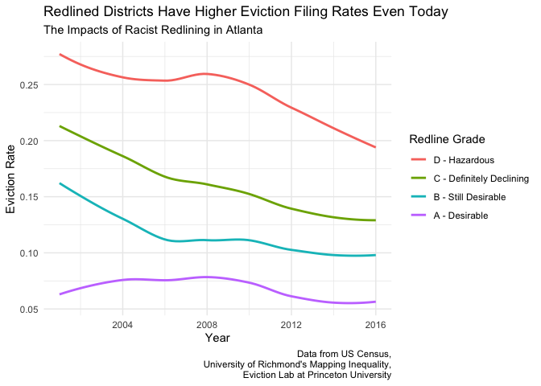
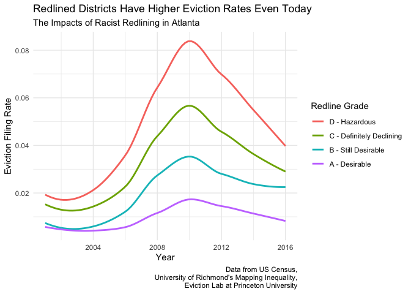
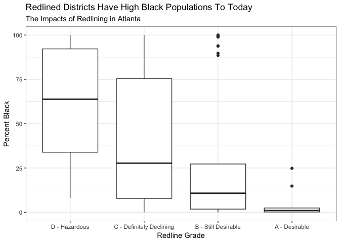
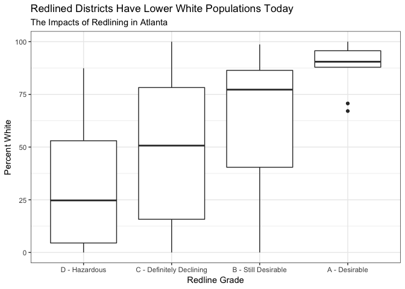
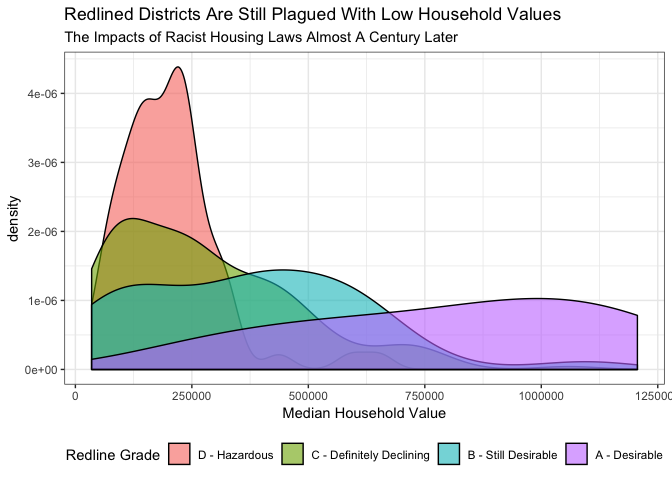
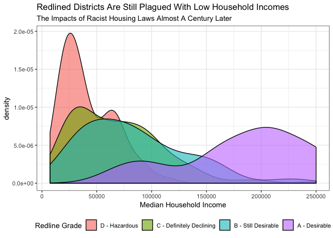
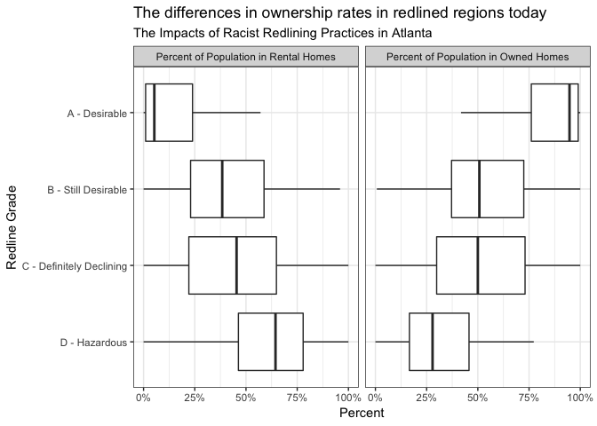
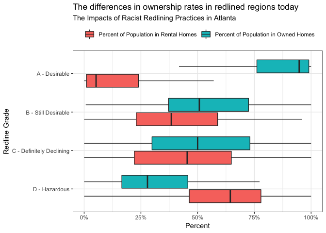
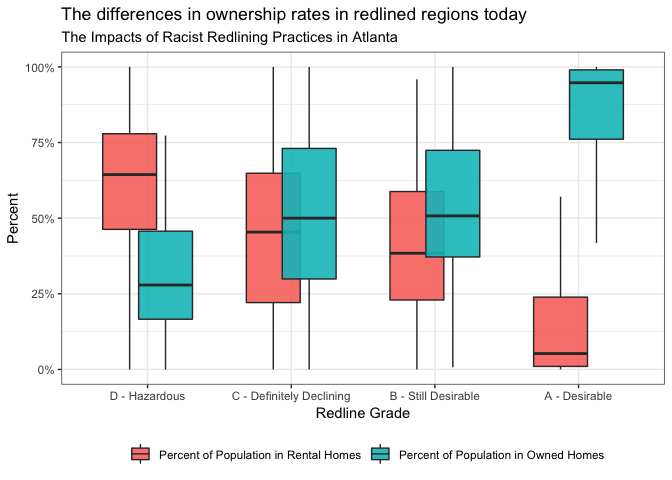

redline-inequality
================
Ife Anyansi
2018-

-   [What is redlining?](#what-is-redlining)
-   [Explore the redline data](#explore-the-redline-data)
-   [Read in eviction and census data](#read-in-eviction-and-census-data)
-   [Exploring the number of evictions today](#exploring-the-number-of-evictions-today)
-   [Exploring demographic statistics for redlined districts](#exploring-demographic-statistics-for-redlined-districts)
-   [Exploring segregation](#exploring-segregation)
-   [Exploring household values and income](#exploring-household-values-and-income)
-   [Exploring homeownership rates](#exploring-homeownership-rates)
-   [It's your turn](#its-your-turn)

``` r
# Libraries
library(tidyverse)
library(compare)
library(sf)
library(lubridate)
library(stringr)
```

``` r
# Blockgroups for Dekalb and Fulton County with redlined districts joined

fname1 = "~/Documents/bg_atlanta/atlanta_holc.shp"

# Census 2016 data

fname2 = "~/Documents/bg_atlanta/census2016.rds"

# Eviction data 

fname3 = "~/Documents/bg_atlanta/gaevictions.rds"
```

What is redlining?
------------------

Redlining districts was a discriminatory practice that was implemented in 1930s by the Federal Housing Administration that blocked minorities' access to mortgages by drawing regions on maps in which housing loans would not be granted or would be unreasonably expensive. The regions that were rated poorly were mostly populated by African Americans, Jews, immigrants, and other minorities as it was thought that their presence would undermine property values. Thus these areas were lacking in proper investment. Although the practice was abolished within the Fair Housing Act in 1968, recent research points out that predatory maps transformed what would occur in these neighorhoods in years to come. In fact, "as recently as 2010, they find, differences in the level of racial segregation, homeownership rates, home values and credit scores were still apparent where these boundaries were drawn."

Please read the New York Times article, <https://www.nytimes.com/2017/08/24/upshot/how-redlinings-racist-effects-lasted-for-decades.html>, for more information regarding this practice. In this challenge you will explore the differences of these redlined districts in term of demographic and eviction data.

What patterns will we find?

Explore the redline data
------------------------

They have digitized the redlined regions in the 1930s accross many cities here: <https://dsl.richmond.edu/panorama/redlining/>.

**q1.1** Follow the link and search for Atlanta GA and understand where we obtained the below graphic. For the purposes of this exercise we will focus on Atlanta, GA.


We have already taken the steps to join the redline map with census block groups for the Atlanta area. Census block groups are geographic units that can be considered neighborhoods with a population of around 1500 - 3000 residents. They can be stored in a geographic shapefile composed of polygon boundaries which are geo-coded with a unique ID found in the `GEOID` column. This redline data is stored in `fname1` and is solely for Dekalb and Fulton counties in Georgia which is where Atlanta and surrounding areas are located.

**q1.2** Read in this shapefile into a sf object called `redline_Atlanta`. Select the following columns -- `GEOID`, `holc_grade`, `holc_id`, `name_1` -- which are the variables that were obtained when downloading the map from q1.1.

Note: `holc_grade` is a variable representing the redline designation of the neighborhood. It is codified as the following: A = "Best", B = "Still Desirable", C = "Definitely Declining", D = "Hazardous". Recall that these gradings were performed in the early 1900s and are based on proportion of minorities in said neighborhood since minority populations were considered to have an undesirable effect to property values and neighborhood quality.

``` r
redline_atlanta <- 
  read_sf(fname1) %>%
  select(GEOID, holc_grade, holc_id, name_1)

glimpse(redline_atlanta)
```

    ## Observations: 934
    ## Variables: 5
    ## $ GEOID      <chr> "131210114103", "131210106041", "131210095022", "13...
    ## $ holc_grade <chr> NA, NA, "B", "C", NA, NA, NA, "C", NA, "C", NA, NA,...
    ## $ holc_id    <chr> NA, NA, "B1", "C", NA, NA, NA, "C36", NA, "C27", NA...
    ## $ name_1     <chr> NA, NA, "Paces Ferry Road Development Company's pro...
    ## $ geometry   <MULTIPOLYGON [°]> MULTIPOLYGON (((-84.29335 3..., MULTIP...

``` r
# Print results
if (exists("redline_atlanta")) redline_atlanta
```

    ## Simple feature collection with 934 features and 4 fields
    ## geometry type:  MULTIPOLYGON
    ## dimension:      XY
    ## bbox:           xmin: -84.85071 ymin: 33.50251 xmax: -84.02371 ymax: 34.18629
    ## epsg (SRID):    4269
    ## proj4string:    +proj=longlat +datum=NAD83 +no_defs
    ## # A tibble: 934 x 5
    ##    GEOID        holc_grade holc_id name_1                         geometry
    ##    <chr>        <chr>      <chr>   <chr>                <MULTIPOLYGON [°]>
    ##  1 131210114103 <NA>       <NA>    <NA>       (((-84.29335 33.99785, -84.…
    ##  2 131210106041 <NA>       <NA>    <NA>       (((-84.47437 33.62653, -84.…
    ##  3 131210095022 B          B1      Paces Fer… (((-84.38513 33.83672, -84.…
    ##  4 131210053003 C          C       <NA>       (((-84.37851 33.73032, -84.…
    ##  5 130890214132 <NA>       <NA>    <NA>       (((-84.3228 33.85167, -84.3…
    ##  6 130890223013 <NA>       <NA>    <NA>       (((-84.29709 33.80051, -84.…
    ##  7 131210099004 <NA>       <NA>    <NA>       (((-84.40878 33.87216, -84.…
    ##  8 131210083022 C          C36     Newer por… (((-84.45383 33.75422, -84.…
    ##  9 130890231072 <NA>       <NA>    <NA>       (((-84.25297 33.74464, -84.…
    ## 10 131210069003 C          C27     Federal P… (((-84.36842 33.72625, -84.…
    ## # ... with 924 more rows

**q1.3** How many block groups were rated A, B, C, or D or had no rating?

``` r
q1.3 <-
  redline_atlanta %>%
  count(holc_grade)

q1.3
```

    ## Simple feature collection with 5 features and 2 fields
    ## geometry type:  MULTIPOLYGON
    ## dimension:      XY
    ## bbox:           xmin: -84.85071 ymin: 33.50251 xmax: -84.02371 ymax: 34.18629
    ## epsg (SRID):    4269
    ## proj4string:    +proj=longlat +datum=NAD83 +no_defs
    ## # A tibble: 5 x 3
    ##   holc_grade     n                                                geometry
    ##   <chr>      <int>                                      <MULTIPOLYGON [°]>
    ## 1 A             10 (((-84.3483 33.79151, -84.34827 33.79209, -84.34833 33…
    ## 2 B             36 (((-84.41816 33.71114, -84.41814 33.71435, -84.40791 3…
    ## 3 C            160 (((-84.39065 33.69393, -84.38961 33.69566, -84.38935 3…
    ## 4 D             78 (((-84.43733 33.6894, -84.43591 33.69108, -84.43047 33…
    ## 5 <NA>         650 (((-84.3766 33.75437, -84.37438 33.75434, -84.3656 33.…

``` r
#solution-end

# Print results
if (exists("q1.3")) q1.3
```

    ## Simple feature collection with 5 features and 2 fields
    ## geometry type:  MULTIPOLYGON
    ## dimension:      XY
    ## bbox:           xmin: -84.85071 ymin: 33.50251 xmax: -84.02371 ymax: 34.18629
    ## epsg (SRID):    4269
    ## proj4string:    +proj=longlat +datum=NAD83 +no_defs
    ## # A tibble: 5 x 3
    ##   holc_grade     n                                                geometry
    ##   <chr>      <int>                                      <MULTIPOLYGON [°]>
    ## 1 A             10 (((-84.3483 33.79151, -84.34827 33.79209, -84.34833 33…
    ## 2 B             36 (((-84.41816 33.71114, -84.41814 33.71435, -84.40791 3…
    ## 3 C            160 (((-84.39065 33.69393, -84.38961 33.69566, -84.38935 3…
    ## 4 D             78 (((-84.43733 33.6894, -84.43591 33.69108, -84.43047 33…
    ## 5 <NA>         650 (((-84.3766 33.75437, -84.37438 33.75434, -84.3656 33.…

**q1.4** Use `case_when` or `recode` to create a new variable called redline which recodes `holc_grade` to the following: "D - Hazardous", "C - Definitely Declining", "B - Still Desirable", "A - Desirable", "Not Graded". Make this column into a factor with levels in the following order: c("D - Hazardous", "C - Definitely Declining", "B - Still Desirable", "A - Desirable", "Not Graded").

Why did we do this? Would it help with interpretation or visualization?

``` r
#solution-begin

redline_atlanta <-
  redline_atlanta %>%
  mutate(
    redline = 
      case_when(
        holc_grade == "A" ~ "A - Desirable",
        holc_grade == "B" ~ "B - Still Desirable",
        holc_grade == "C" ~ "C - Definitely Declining",
        holc_grade == "D" ~ "D - Hazardous",
        TRUE ~ "Not Graded" 
      )
  ) %>%
  mutate(
    redline = 
      factor(
        redline,
        levels = 
          c(
            "D - Hazardous",
            "C - Definitely Declining",
            "B - Still Desirable",
            "A - Desirable",
            "Not Graded"
          )
      )
  )

glimpse(redline_atlanta)
```

    ## Observations: 934
    ## Variables: 6
    ## $ GEOID      <chr> "131210114103", "131210106041", "131210095022", "13...
    ## $ holc_grade <chr> NA, NA, "B", "C", NA, NA, NA, "C", NA, "C", NA, NA,...
    ## $ holc_id    <chr> NA, NA, "B1", "C", NA, NA, NA, "C36", NA, "C27", NA...
    ## $ name_1     <chr> NA, NA, "Paces Ferry Road Development Company's pro...
    ## $ redline    <fct> Not Graded, Not Graded, B - Still Desirable, C - De...
    ## $ geometry   <MULTIPOLYGON [°]> MULTIPOLYGON (((-84.29335 3..., MULTIP...

``` r
# Print results
if (exists("redline_atlanta")) redline_atlanta
```

    ## Simple feature collection with 934 features and 5 fields
    ## geometry type:  MULTIPOLYGON
    ## dimension:      XY
    ## bbox:           xmin: -84.85071 ymin: 33.50251 xmax: -84.02371 ymax: 34.18629
    ## epsg (SRID):    4269
    ## proj4string:    +proj=longlat +datum=NAD83 +no_defs
    ## # A tibble: 934 x 6
    ##    GEOID  holc_grade holc_id name_1    redline                    geometry
    ##    <chr>  <chr>      <chr>   <chr>     <fct>            <MULTIPOLYGON [°]>
    ##  1 13121… <NA>       <NA>    <NA>      Not Gr… (((-84.29335 33.99785, -84…
    ##  2 13121… <NA>       <NA>    <NA>      Not Gr… (((-84.47437 33.62653, -84…
    ##  3 13121… B          B1      Paces Fe… B - St… (((-84.38513 33.83672, -84…
    ##  4 13121… C          C       <NA>      C - De… (((-84.37851 33.73032, -84…
    ##  5 13089… <NA>       <NA>    <NA>      Not Gr… (((-84.3228 33.85167, -84.…
    ##  6 13089… <NA>       <NA>    <NA>      Not Gr… (((-84.29709 33.80051, -84…
    ##  7 13121… <NA>       <NA>    <NA>      Not Gr… (((-84.40878 33.87216, -84…
    ##  8 13121… C          C36     Newer po… C - De… (((-84.45383 33.75422, -84…
    ##  9 13089… <NA>       <NA>    <NA>      Not Gr… (((-84.25297 33.74464, -84…
    ## 10 13121… C          C27     Federal … C - De… (((-84.36842 33.72625, -84…
    ## # ... with 924 more rows

Read in eviction and census data
--------------------------------

Eviction data was downloaded from eviction lab at Princeton University. It contains the number of evictions and eviction rates in a census block group. If you are curious with the methods and variable names please see here: <https://evictionlab.org/methods/#section-name>

Census data was collected from the US Census's America's Community Survey. We have collected a load of interesting census statistics with a GEOID column.

**q1.5** Lastly, read in census data into a tibble named `census_2016`. Read in eviction data into a variable named `gaevictions`. Filter gaevictions so that it only contains data for Dekalb and Fulton counties. Use glimpse to understand the format of this data.

Hint: Semi join might be helpful.

``` r
#reading in census data

census2016 <- read_rds(fname2)

#reading in eviction data

gaevictions <- read_rds(fname3)

gaevictions <- 
  gaevictions %>%
  semi_join(redline_atlanta, by = "GEOID")

# Print results
if (exists("gaevictions")) gaevictions
```

    ## # A tibble: 15,878 x 26
    ##    GEOID        year name  `parent-location`     population `poverty-rate`
    ##    <chr>       <int> <chr> <chr>                      <dbl>          <dbl>
    ##  1 1308902010…  2000 201.1 DeKalb County, Georg…       1783           4.71
    ##  2 1308902010…  2001 201.1 DeKalb County, Georg…       1783           4.71
    ##  3 1308902010…  2002 201.1 DeKalb County, Georg…       1783           4.71
    ##  4 1308902010…  2003 201.1 DeKalb County, Georg…       1783           4.71
    ##  5 1308902010…  2004 201.1 DeKalb County, Georg…       1783           4.71
    ##  6 1308902010…  2005 201.1 DeKalb County, Georg…       2180           0.6 
    ##  7 1308902010…  2006 201.1 DeKalb County, Georg…       2180           0.6 
    ##  8 1308902010…  2007 201.1 DeKalb County, Georg…       2180           0.6 
    ##  9 1308902010…  2008 201.1 DeKalb County, Georg…       2180           0.6 
    ## 10 1308902010…  2009 201.1 DeKalb County, Georg…       2180           0.6 
    ## # ... with 15,868 more rows, and 20 more variables:
    ## #   `pct-renter-occupied` <dbl>, `median-gross-rent` <dbl>,
    ## #   `median-household-income` <dbl>, `median-property-value` <dbl>,
    ## #   `rent-burden` <dbl>, `pct-white` <dbl>, `pct-af-am` <dbl>,
    ## #   `pct-hispanic` <dbl>, `pct-am-ind` <dbl>, `pct-asian` <dbl>,
    ## #   `pct-nh-pi` <dbl>, `pct-multiple` <dbl>, `pct-other` <dbl>,
    ## #   renter_occupied_households <dbl>, eviction_filings <dbl>,
    ## #   evictions <dbl>, eviction_rate <dbl>, eviction_filing_rate <dbl>,
    ## #   imputed <int>, subbed <int>

Exploring the number of evictions today
---------------------------------------

Now we will use the eviction dataset to see how the different redlined regions may have differential rates of evictions today. Before we use this data, you may have noticed that evictions2016 has eviction data for varying years.

**q2.1** What is the latest year and oldest year that we have eviction data on?

``` r
q2.1 <-
  gaevictions %>%
  summarise(min(year), max(year))

q2.1
```

    ## # A tibble: 1 x 2
    ##   `min(year)` `max(year)`
    ##         <dbl>       <dbl>
    ## 1        2000        2016

**q2.2** What is the latest year and oldest year that we have eviction data on for each distinct GEOID? Does each GEOID have the same number of years represented? Why do you think we needed to check this?

``` r
gaevictions %>% 
  count(GEOID) %>%
  distinct(n)
```

    ## # A tibble: 1 x 1
    ##       n
    ##   <int>
    ## 1    17

``` r
gaevictions %>% 
  group_by(GEOID) %>%
  summarise(
    minyear = min(year), 
    maxyear = max(year)
  ) %>%
  distinct(minyear, maxyear)
```

    ## # A tibble: 1 x 2
    ##   minyear maxyear
    ##     <dbl>   <dbl>
    ## 1    2000    2016

To explore the differential rates of eviction by year in redlined districts we need to calculate eviction rates. In the `gaevictions` tibble, we have both eviction rate and evicition filing rate for each year. By reading the eviction lab website we obtain the below information on how these were calculated.

A “filing rate” is the ratio of the number of evictions filed in an area over the number of renter-occupied homes in that area. An “eviction rate” is the subset of those homes that received an eviction judgement in which renters were ordered to leave. For the denominator of our rate, we used the number of occupied renting households in each area.

**q2.3** Combine `redline_atlanta` that was saved in q1.4 with `gaevictions` using a join. Calculate the eviction rate and eviction filing rate by year for each redline grade. The final tibble should be stored in a variable named `q2.3` with these additional five columns: total\_eviction\_filings, total\_evictions, total\_rent\_occ, eviction\_rate, eviction\_filing\_rate.

Note: Remember that in q1.4 we made a new variable called `redline` in `gaevictions` that held all the redline grades.

Hint:

-   The following columns in gaevictions may be useful: eviction\_filings, evictions, renter\_occupied\_households.

-   We cannot summarise by taking the mean of the rates when grouped by its redline grade and year because different GEOIDS can have different number of renter occupied households. Remember, we can never take the mean of a rate and expect to be able to interpret results. We must calculate rates from scratch.

``` r
df <-
  redline_atlanta %>%
  left_join(gaevictions, by = "GEOID")

q2.3 <-
  df %>%
  group_by(redline, year) %>%
  summarise(
    total_eviction_filings = sum(eviction_filings),
    total_evictions = sum(evictions),
    total_rent_occ = sum(renter_occupied_households)
  ) %>%
  mutate(
    eviction_rate = total_evictions / total_rent_occ,
    eviction_filing_rate = total_eviction_filings / total_rent_occ
  )


# Print results
if (exists("q2.3")) q2.3
```

    ## Simple feature collection with 85 features and 7 fields
    ## geometry type:  MULTIPOLYGON
    ## dimension:      XY
    ## bbox:           xmin: -84.85071 ymin: 33.50251 xmax: -84.02371 ymax: 34.18629
    ## epsg (SRID):    4269
    ## proj4string:    +proj=longlat +datum=NAD83 +no_defs
    ## # A tibble: 85 x 8
    ## # Groups:   redline [5]
    ##    redline       year total_eviction_filin… total_evictions total_rent_occ
    ##    <fct>        <int>                 <dbl>           <dbl>          <dbl>
    ##  1 D - Hazardo…  2000                    NA              NA          27392
    ##  2 D - Hazardo…  2001                  7676             523          27377
    ##  3 D - Hazardo…  2002                  7274             530          27352
    ##  4 D - Hazardo…  2003                  7287             490          27342
    ##  5 D - Hazardo…  2004                  6495             495          27322
    ##  6 D - Hazardo…  2005                  6873             513          27325
    ##  7 D - Hazardo…  2006                  7201            1179          27292
    ##  8 D - Hazardo…  2007                  6906            1330          27278
    ##  9 D - Hazardo…  2008                  7282            1582          27259
    ## 10 D - Hazardo…  2009                  6405            2014          27244
    ## # ... with 75 more rows, and 3 more variables: eviction_rate <dbl>,
    ## #   eviction_filing_rate <dbl>, geometry <MULTIPOLYGON [°]>

**q2.4** Plot eviction rate and eviction filing rate over time and set `redline` to the color aesthetic. What do you find? Interpret your results and why you think it's better to analyse the rates rather than just total evictions and filings.

Note: We are not concerned with plotting data for the neighborhoods with no redline grade. Hint: Use geom\_smooth(se = FALSE)

``` r
q2.3 %>%
  filter(!is.na(redline),  redline != "Not Graded") %>%
  ggplot(mapping = aes(x = year, y = eviction_filing_rate, color = redline)) +
  geom_smooth(se = FALSE) +
  labs(
    title = "Redlined Districts Have Higher Eviction Filing Rates Even Today",
    subtitle = "The Impacts of Racist Redlining in Atlanta",
    caption = "Data from US Census,
    University of Richmond's Mapping Inequality,
    Eviction Lab at Princeton University",
    x = "Year", 
    y = "Eviction Rate"
  ) +
  guides(color = guide_legend(title = "Redline Grade")) +
  theme_minimal() +
  scale_colour_hue()
```

    ## `geom_smooth()` using method = 'loess' and formula 'y ~ x'

    ## Warning: Removed 4 rows containing non-finite values (stat_smooth).



``` r
q2.3 %>%
  filter(!is.na(redline), redline != "Not Graded") %>%
  ggplot(mapping = aes(x = year, y = eviction_rate, color = redline)) +
  geom_smooth(se = FALSE) +
  labs(
    title = "Redlined Districts Have Higher Eviction Rates Even Today",
    subtitle = "The Impacts of Racist Redlining in Atlanta",
    caption = "Data from US Census,
    University of Richmond's Mapping Inequality,
    Eviction Lab at Princeton University",
    x = "Year",
    y = "Eviction Filing Rate"
  ) +
  guides(color = guide_legend(title = "Redline Grade")) +
  theme_minimal() +
  scale_colour_hue()
```

    ## `geom_smooth()` using method = 'loess' and formula 'y ~ x'

    ## Warning: Removed 4 rows containing non-finite values (stat_smooth).



Exploring demographic statistics for redlined districts
-------------------------------------------------------

Now it's time to explore demographic statistics for the redlined zones using today's data. It is said that redlining from the 1930s may have led to amplified racial segregation, differential ownership rates and house values. Although it is beyond the scope of this data exploration exercise to explore causal claims (look up spatial causal inference to see how this can be done), we can still validate the claims that such differences exist. Now, let's explore these individually.

**q3.1** Use names() on census2016 to find the variables that we have data for.

``` r
names(census2016)
```

    ##   [1] "areaname"                 "county"                  
    ##   [3] "TotPop"                   "MedianAge"               
    ##   [5] "pctOver25"                "pctOver65"               
    ##   [7] "pctMales"                 "pctFemales"              
    ##   [9] "pctWhite1"                "pctBlack1"               
    ##  [11] "pctIndian1"               "pctAsian1"               
    ##  [13] "pctWhite2"                "pctBlack2"               
    ##  [15] "pctHispanicPop"           "pctNonHispPop"           
    ##  [17] "pctNonHispWhite"          "TotHHs"                  
    ##  [19] "pctHHInc0"                "pctHHInc10"              
    ##  [21] "pctHHInc15"               "pctHHInc25"              
    ##  [23] "pctHHInc35"               "pctHHInc50"              
    ##  [25] "pctHHInc75"               "pctHHInc100"             
    ##  [27] "pctHHInc150"              "pctHHInc200"             
    ##  [29] "pctNumHHEarnings"         "pctNumHHSocSec"          
    ##  [31] "pctNumHHRetInc"           "pctNumHHSuppSecInc"      
    ##  [33] "pctNumHHPubAssist"        "pctNumHHFoodStmp"        
    ##  [35] "MedianHHInc"              "pctFamHHs"               
    ##  [37] "pctFamHHInc0"             "pctFamHHInc10"           
    ##  [39] "pctFamHHInc15"            "pctFamHHInc25"           
    ##  [41] "pctFamHHInc35"            "pctFamHHInc50"           
    ##  [43] "pctFamHHInc75"            "pctFamHHInc100"          
    ##  [45] "pctFamHHInc150"           "pctFamHHInc200"          
    ##  [47] "MedianFamInc"             "PCI"                     
    ##  [49] "pctFullTimeWorkersMale"   "pctFullTimeWorkersFemale"
    ##  [51] "MedianEarnings"           "pctPoor"                 
    ##  [53] "pctPoorUnder18"           "pctPoor18to64"           
    ##  [55] "pctPoorOver65"            "pctPoorFamilies"         
    ##  [57] "pctLaborForce"            "pctCivLabForce"          
    ##  [59] "pctEmployedCLF"           "pctUnemployedCLF"        
    ##  [61] "pctLaborForceFemales"     "pctCivLabForceFemales"   
    ##  [63] "pctEmployedFemales"       "pctConstruction"         
    ##  [65] "pctRetailTrade"           "pctProfessional"         
    ##  [67] "pctFamsWithKids"          "pctMarriedCouples"       
    ##  [69] "pctSingleFemaleFamilies"  "pctSingleMothers"        
    ##  [71] "pctNeverMarried"          "pctLessThan9th"          
    ##  [73] "pctSomeHighSchool"        "pctHighSchool"           
    ##  [75] "pctSomeCollege"           "pctAssociates"           
    ##  [77] "pctBachelors"             "pctGradProf"             
    ##  [79] "pctHighSchoolOrMore"      "pctBachelorsormore"      
    ##  [81] "pctDisabled"              "pctOwnerOcc"             
    ##  [83] "pctRenterOcc"             "pctVacantForSale"        
    ##  [85] "pctVacantForRent"         "OwnerVacRate"            
    ##  [87] "pctPersonsInOwnerUnits"   "pctPersonsInRenterUnits" 
    ##  [89] "pctBuilt2010orLater"      "pctBuilt2000_2009"       
    ##  [91] "pctBuilt1990_1999"        "pctBuilt1980_1989"       
    ##  [93] "pctBuilt1970_1979"        "pctBuilt1960_1969"       
    ##  [95] "pctBuilt1950_1959"        "pctBuilt1940_1949"       
    ##  [97] "pctBuiltBefore1940"       "pctMovedIn2010orLater"   
    ##  [99] "pctMovedInBefore1980"     "pctNoVehicles"           
    ## [101] "pctNoPlumbing"            "pctNoKitchen"            
    ## [103] "HvalUnder50"              "pctHvalUnder50"          
    ## [105] "Hval50"                   "pctHval50"               
    ## [107] "Hval100"                  "pctHval100"              
    ## [109] "Hval150"                  "pctHval150"              
    ## [111] "Hval200"                  "pctHval200"              
    ## [113] "Hval300"                  "pctHval300"              
    ## [115] "Hval500"                  "pctHval500"              
    ## [117] "HvalOverMillion"          "pctHvalOverMillion"      
    ## [119] "HvalOver2Million"         "pctHvalOver2Million"     
    ## [121] "MedianHValue"             "AvgHValue"               
    ## [123] "pctHUsMort"               "pctHUsMortOver30Pct"     
    ## [125] "MedianOwnerCostsMort"     "pctHUsNoMort"            
    ## [127] "MedianOwnerCostsNoMort"   "pctCashRenter"           
    ## [129] "MedianGrossRent"          "pctCashRenterOver30Pct"  
    ## [131] "GEOID"

**q3.2** Use select\_if to only keep variables where at least 25% of the statistics is not NA.

``` r
census2016 <-
  census2016 %>%
  select_if(~mean(is.na(.)) < .25)
```

**q3.3** Join `census2016` with the redlined districts stored in `redline_atlanta` and save it in `q3.3`.

``` r
q3.3 <-
  redline_atlanta %>%
  left_join(census2016, by = "GEOID")


# Print results
if (exists("q3.3")) q3.3
```

    ## Simple feature collection with 934 features and 121 fields
    ## geometry type:  MULTIPOLYGON
    ## dimension:      XY
    ## bbox:           xmin: -84.85071 ymin: 33.50251 xmax: -84.02371 ymax: 34.18629
    ## epsg (SRID):    4269
    ## proj4string:    +proj=longlat +datum=NAD83 +no_defs
    ## # A tibble: 934 x 122
    ##    GEOID  holc_grade holc_id name_1     redline  areaname    county TotPop
    ##    <chr>  <chr>      <chr>   <chr>      <fct>    <chr>        <int>  <dbl>
    ##  1 13121… <NA>       <NA>    <NA>       Not Gra… Block Grou…  13121   1962
    ##  2 13121… <NA>       <NA>    <NA>       Not Gra… Block Grou…  13121    730
    ##  3 13121… B          B1      Paces Fer… B - Sti… Block Grou…  13121    256
    ##  4 13121… C          C       <NA>       C - Def… Block Grou…  13121    630
    ##  5 13089… <NA>       <NA>    <NA>       Not Gra… Block Grou…  13089   1237
    ##  6 13089… <NA>       <NA>    <NA>       Not Gra… Block Grou…  13089   1028
    ##  7 13121… <NA>       <NA>    <NA>       Not Gra… Block Grou…  13121    888
    ##  8 13121… C          C36     Newer por… C - Def… Block Grou…  13121   1065
    ##  9 13089… <NA>       <NA>    <NA>       Not Gra… Block Grou…  13089   1193
    ## 10 13121… C          C27     Federal P… C - Def… Block Grou…  13121   1203
    ## # ... with 924 more rows, and 114 more variables: MedianAge <dbl>,
    ## #   pctOver25 <dbl>, pctOver65 <dbl>, pctMales <dbl>, pctFemales <dbl>,
    ## #   pctWhite1 <dbl>, pctBlack1 <dbl>, pctIndian1 <dbl>, pctAsian1 <dbl>,
    ## #   pctWhite2 <dbl>, pctBlack2 <dbl>, pctHispanicPop <dbl>,
    ## #   pctNonHispPop <dbl>, pctNonHispWhite <dbl>, TotHHs <dbl>,
    ## #   pctHHInc0 <dbl>, pctHHInc10 <dbl>, pctHHInc15 <dbl>, pctHHInc25 <dbl>,
    ## #   pctHHInc35 <dbl>, pctHHInc50 <dbl>, pctHHInc75 <dbl>,
    ## #   pctHHInc100 <dbl>, pctHHInc150 <dbl>, pctHHInc200 <dbl>,
    ## #   pctNumHHEarnings <dbl>, pctNumHHSocSec <dbl>, pctNumHHRetInc <dbl>,
    ## #   pctNumHHSuppSecInc <dbl>, pctNumHHPubAssist <dbl>, MedianHHInc <chr>,
    ## #   pctFamHHs <dbl>, pctFamHHInc0 <dbl>, pctFamHHInc10 <dbl>,
    ## #   pctFamHHInc15 <dbl>, pctFamHHInc25 <dbl>, pctFamHHInc35 <dbl>,
    ## #   pctFamHHInc50 <dbl>, pctFamHHInc75 <dbl>, pctFamHHInc100 <dbl>,
    ## #   pctFamHHInc150 <dbl>, pctFamHHInc200 <dbl>, PCI <chr>,
    ## #   pctPoorFamilies <dbl>, pctLaborForce <dbl>, pctCivLabForce <dbl>,
    ## #   pctEmployedCLF <dbl>, pctUnemployedCLF <dbl>, pctConstruction <dbl>,
    ## #   pctRetailTrade <dbl>, pctProfessional <dbl>, pctFamsWithKids <dbl>,
    ## #   pctMarriedCouples <dbl>, pctSingleFemaleFamilies <dbl>,
    ## #   pctSingleMothers <dbl>, pctNeverMarried <dbl>, pctLessThan9th <dbl>,
    ## #   pctSomeHighSchool <dbl>, pctHighSchool <dbl>, pctSomeCollege <dbl>,
    ## #   pctAssociates <dbl>, pctBachelors <dbl>, pctGradProf <dbl>,
    ## #   pctHighSchoolOrMore <dbl>, pctBachelorsormore <dbl>,
    ## #   pctOwnerOcc <dbl>, pctRenterOcc <dbl>, pctVacantForSale <dbl>,
    ## #   pctVacantForRent <dbl>, OwnerVacRate <dbl>,
    ## #   pctPersonsInOwnerUnits <dbl>, pctPersonsInRenterUnits <dbl>,
    ## #   pctBuilt2010orLater <dbl>, pctBuilt2000_2009 <dbl>,
    ## #   pctBuilt1990_1999 <dbl>, pctBuilt1980_1989 <dbl>,
    ## #   pctBuilt1970_1979 <dbl>, pctBuilt1960_1969 <dbl>,
    ## #   pctBuilt1950_1959 <dbl>, pctBuilt1940_1949 <dbl>,
    ## #   pctBuiltBefore1940 <dbl>, pctMovedIn2010orLater <dbl>,
    ## #   pctMovedInBefore1980 <dbl>, pctNoVehicles <dbl>, pctNoPlumbing <dbl>,
    ## #   pctNoKitchen <dbl>, HvalUnder50 <int>, pctHvalUnder50 <dbl>,
    ## #   Hval50 <int>, pctHval50 <dbl>, Hval100 <int>, pctHval100 <dbl>,
    ## #   Hval150 <int>, pctHval150 <dbl>, Hval200 <int>, pctHval200 <dbl>,
    ## #   Hval300 <dbl>, pctHval300 <dbl>, Hval500 <int>, pctHval500 <dbl>, …

Exploring segregation
---------------------

**q3.4.1** Create two seperate plots that plot the distribution of black and white population by redline grade using the tibble from q3.2. What do you find? Remember to exclude not graded districts for all visualizations.

-   `pctBlack1`: Percent black in neighborhood
-   `pctNonHispWhite`: Percent non hispanic white in neighborhood

``` r
q3.3 %>%
  filter(!is.na(redline), redline != "Not Graded") %>%
  ggplot(mapping = aes(x = redline, y = pctBlack1)) +
  geom_boxplot() +
  labs(
    title = "Redlined Districts Have High Black Populations To Today", 
    subtitle = "The Impacts of Redlining in Atlanta",
    y = "Percent Black",
    x = "Redline Grade"
  ) +
  theme_bw()
```

    ## Warning: Removed 2 rows containing non-finite values (stat_boxplot).



``` r
q3.3 %>%
  filter(!is.na(redline), redline != "Not Graded") %>%
  ggplot(mapping = aes(x = redline, y = pctNonHispWhite)) +
  geom_boxplot() +
  labs(
    title = "Redlined Districts Have Lower White Populations Today", 
    subtitle = "The Impacts of Redlining in Atlanta",
    y = "Percent White",
    x = "Redline Grade"
  ) +
  theme_bw()
```

    ## Warning: Removed 2 rows containing non-finite values (stat_boxplot).



Exploring household values and income
-------------------------------------

**q3.4.2** Create two separate density plots that plot the distribution of house values and household incomes by redline grade. What do you find?

-   `MedianHValue`: Median Household Value
-   `MedianHHInc`: Median Household Income

Note: Use theme to put your legend at the bottom. Use alpha to see overlapping regions.

Hint: You may need to mutate these variables using `parse_number` or `str_replace` as they are currently stored as characters and these strings contain "$" and ",".

``` r
q3.4 <-
  q3.3 %>%
  select(GEOID, redline, MedianHValue, MedianHHInc) %>%
  mutate(
    MedianHValue = str_replace(MedianHValue, "[$]", ""),
    MedianHValue = str_replace(MedianHValue, "[,]", ""),
    MedianHValue = as.double(MedianHValue),
    MedianHHInc = parse_number(MedianHHInc)
  )

q3.4 %>%
  filter(redline != "Not Graded") %>%
  ggplot(mapping = aes(x = MedianHValue, fill = redline), color = "black") +
  geom_density(alpha = 0.6) +
  theme_bw() +
  theme(legend.position = "bottom") +
  labs(
    title = "Redlined Districts Are Still Plagued With Low Household Values",
    subtitle = "The Impacts of Racist Housing Laws Almost A Century Later",
    x = "Median Household Value",
    fill = "Redline Grade"
  )
```

    ## Warning: Removed 31 rows containing non-finite values (stat_density).



``` r
q3.4 %>%
filter(!is.na(redline), redline != "Not Graded") %>%
 ggplot(mapping = aes(x = MedianHHInc, fill = redline), color = "black") +
  geom_density(alpha = 0.6) +
  theme_bw() +
  theme(legend.position = "bottom") +
  labs(
    title = "Redlined Districts Are Still Plagued With Low Household Incomes",
    subtitle = "The Impacts of Racist Housing Laws Almost A Century Later",
    x = "Median Household Income",
    fill = "Redline Grade"
  )
```

    ## Warning: Removed 15 rows containing non-finite values (stat_density).



``` r
# Print results
if (exists("q3.4")) q3.4
```

    ## Simple feature collection with 934 features and 4 fields
    ## geometry type:  MULTIPOLYGON
    ## dimension:      XY
    ## bbox:           xmin: -84.85071 ymin: 33.50251 xmax: -84.02371 ymax: 34.18629
    ## epsg (SRID):    4269
    ## proj4string:    +proj=longlat +datum=NAD83 +no_defs
    ## # A tibble: 934 x 5
    ##    GEOID        redline MedianHValue MedianHHInc                  geometry
    ##    <chr>        <fct>          <dbl>       <dbl>        <MULTIPOLYGON [°]>
    ##  1 131210114103 Not Gr…       349600      115337 (((-84.29335 33.99785, -…
    ##  2 131210106041 Not Gr…           NA       27500 (((-84.47437 33.62653, -…
    ##  3 131210095022 B - St…        90300       36109 (((-84.38513 33.83672, -…
    ##  4 131210053003 C - De…       290600      106912 (((-84.37851 33.73032, -…
    ##  5 130890214132 Not Gr…       287500       36042 (((-84.3228 33.85167, -8…
    ##  6 130890223013 Not Gr…       240800       73768 (((-84.29709 33.80051, -…
    ##  7 131210099004 Not Gr…       956600      250001 (((-84.40878 33.87216, -…
    ##  8 131210083022 C - De…        60700       35032 (((-84.45383 33.75422, -…
    ##  9 130890231072 Not Gr…        86900       29531 (((-84.25297 33.74464, -…
    ## 10 131210069003 C - De…       159300       68000 (((-84.36842 33.72625, -…
    ## # ... with 924 more rows

Exploring homeownership rates
-----------------------------

Now we will explore homeownership rates using two of the four following variables.

-   `pctRenterOcc`: Percent of household units that are occupied by renters
-   `pctOwnerOcc`: Percent of household units that are occupied by its owners

OR

-   `pctPersonsInRenterUnits`: Percent of population in rental units
-   `pctPersonsInOwnerUnits`: Percent of population in owned units

**q3.4.3.1** Now instead of creating two seperate plots like we did in the last two questions, we will explore how to do this using facet\_wrap and store this information on only one plot. To implement this we need to do a bit more wrangling. Use the tibble from `q3.3` and select `redline`, `GEOID` and two of the variables you've chosen above.

What would be the difference in using the first pair of vars (pctRenterOcc, pctOwnerOcc) vs. the second (pctPersonsInRenterUnits, pctPersonsinOwnerUnits)?

``` r
q3.4.3.1 <-
  q3.3 %>%
  select(
    GEOID, redline, pctPersonsInRenterUnits, pctPersonsInOwnerUnits
  )
```

**q3.4.3.2** Use `gather` to convert the two variables you've chosen into these new columns, `variable` and `value`. Next, convert `variable` into a factor with levels in the order of renter first then owner and appropriate levels. We do this so that when we plot the renter information is plotted first.

Note: `gather` doesn't work as is because you still have your sf geometries in your tibble. Perform `st_set_geometry(x, NULL)` in order to get it to a tibble before using gather.

``` r
q3.4.3.1 <- st_set_geometry(q3.4.3.1, NULL)

q3.4.3.2 <-
  q3.4.3.1 %>%
  gather(variable, value, -GEOID, -redline) %>%
  mutate(
    variable = factor(
      variable,
      levels = c("pctPersonsInRenterUnits", "pctPersonsInOwnerUnits"),
      labels = c(
        "Percent of Population in Rental Homes",
        "Percent of Population in Owned Homes"
      )
    ),
    value = value / 100
  )
```

**q3.4.3.3** Now use facet\_grid or facet\_wrap with nrow = 1 to plot the distribution of ownership rates by redline grade.

Hint: The variable that you must facet on was created in the previous section. `coord_flip` may be helpful.

``` r
q3.4.3.2 %>%
  filter(!is.na(redline), redline != "Not Graded") %>%
  ggplot(mapping = aes(x = redline, y = value)) +
  geom_boxplot() +
  labs(
    title = "The differences in ownership rates in redlined regions today ", 
    subtitle = "The Impacts of Racist Redlining Practices in Atlanta",
    x = "Redline Grade",
    y = "Percent"
  ) +
  theme_bw() + 
  facet_wrap(~ variable, nrow = 1) + 
  coord_flip() +
  scale_y_continuous(labels = scales::percent)
```

    ## Warning: Removed 4 rows containing non-finite values (stat_boxplot).



**q3.4.3.4** Can we visualize ownership rates by redline grade without using facetting and instead plot everything on one graph? Show how can this be done. Interpret results. Are homeownership rates different in the regions today?

Hint: If you decide not to use coord\_flip here, you may find geom\_boxplot(position = position\_dodge(width = ???)) useful to set the distance between boxplots. Also using alpha might be helpful if you have overlapping boxplots.

``` r
q3.4.3.2 %>%
  filter(!is.na(redline), redline != "Not Graded") %>%
  ggplot(mapping = aes(x = redline, y = value, fill = variable)) +
  geom_boxplot() +
  labs(
    title = "The differences in ownership rates in redlined regions today ", 
    subtitle = "The Impacts of Racist Redlining Practices in Atlanta",
    x = "Redline Grade",
    y = "Percent",
    fill = NULL
  ) +
  theme_bw() + 
  coord_flip() +
  scale_y_continuous(labels = scales::percent) +
  theme(
    legend.position = "top"
  )
```

    ## Warning: Removed 4 rows containing non-finite values (stat_boxplot).



``` r
q3.4.3.2 %>%
  filter(!is.na(redline), redline != "Not Graded") %>%
  ggplot(mapping = aes(x = redline, y = value, fill = variable)) +
  geom_boxplot(position = position_dodge(width = .5), alpha = 0.9) +
  labs(
    title = "The differences in ownership rates in redlined regions today ", 
    subtitle = "The Impacts of Racist Redlining Practices in Atlanta",
    x = "Redline Grade",
    y = "Percent",
    fill = NULL
  ) +
  theme_bw() +
  theme(
    legend.position = "bottom"
  ) +
  scale_y_continuous(labels = scales::percent)
```

    ## Warning: Removed 4 rows containing non-finite values (stat_boxplot).



It's your turn
--------------

There are many other variables in `census_2016`. Previously, we have decided to explore rates in racial segregation, household values and income, and homeownership for redlined districts. What other differences may exist?

**q4** Choose another demographic statistic to explore and create a visualization What do you find?

Note: "HH" stands for Households. "HU" stands for household units. "CLF" stands for Civillian Labor Force (that is the population that is working or looking for work and is not in the military). "Fam" stands for family. "Mort" stands for mortgage. "pctHHInc0" gives the percent of households with incomes from 0 to 10k. "pctHval50" gives the household values between 50k to 100k. "Vac" stands for Vacant or Vacancy. "PubAssist" stands for Public Assistance. "SuppSecInc" stands for supplementary security income. "SocSec" stands for social security.
